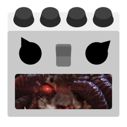

# Godot Sound Manager

_Lefrec Version_

A simple music and sound effect player for the [Godot Engine](https://godotengine.org/).

This is a fork from [Nathanhoad's Sound Manager](https://github.com/nathanhoad/godot_sound_manager) aimed to simplify features I did not need and add some I wanted.

Go check the original if you don't care about the modifications I made.

## Installation

- Copy the `addons/sound_manager` directory from this repository into your project's `res://addons/` directory.
- Enable **SoundManager - Lefrec version** in **Project** → **Project Settings**.
- Access the `SoundManager` singleton anywhere in your project.

## Features

### Base features

- Pooled audio players
- Handles music crossfades
- ~~Autodetect probable audio buses for both sounds and music~~
- ~~Splits sounds up into UI sounds and local sounds~~ -> Split sounds up into sound effects, UI sounds, ambient sounds and music
- ~~Supports both GDScript and C#~~ -> Only GDScript is supported for now

### Added features

- Unique bus for every audio type
- Volume and mute control over every bus
- Audio effect control over every bus

### Small changes

- Unified volume to use linear values everywhere
- Gave fading smoother symmetrical transitions

### Possible future features

- Adding optional spatialization to sound effects
- Adding optional spatialization to ambient sounds
- Allow looping ambient sounds
- Playlist system for music

## Documentation

- [Getting Started](./doc/Getting_Started.md)
- [Sound Effects and UI Sounds](./doc/Sound_Effects_and_UI_Sounds.md)
- [Ambient Sounds](./doc/Ambient_Sounds.md)
- [Music](./doc/Music.md)
- [Volume and Effects](./doc/Volume_and_Effects.md)
- [Other Features](./doc/Other_Features.md)
